# 🇧🇷 Brazil E-Commerce Sales Analytics Dashboard | SQL + Power BI


## 📌 Project Overview

This project analyzes the Brazilian Olist E-Commerce dataset using PostgreSQL and Power BI to uncover sales performance, customer behavior, delivery efficiency, payment trends, seller performance, and product insights.

The objective was to transform raw transactional data into an interactive business intelligence solution that helps stakeholders monitor KPIs, identify growth opportunities, and make data-driven decisions.

The project demonstrates the complete analytics workflow:

- Database Design
- SQL Data Modeling
- Data Transformation
- Power BI Dashboard Development
- Business Insight Generation

## 🎯 Business Problem

An e-commerce business generates data from multiple sources, making it difficult to understand overall business performance.

This dashboard answers questions such as:

- Which product categories generate the highest revenue?
- Which states and cities contribute the most sales?
- How have sales changed over time?
- Which sellers drive the highest revenue?
- Which payment methods are most popular?
- Which categories experience the highest delivery delays?
- How do delivery performance and customer ratings relate?
- What business actions can improve profitability?

## 📂 Dataset

Dataset: Olist Brazilian E-Commerce Public Dataset

The dataset contains information about:

- Customers
- Orders
- Order Items
- Products
- Sellers
- Payments
- Reviews
- Geolocation

Approximately 100,000+ orders were analyzed covering 2016–2018.

## 🛠 Tech Stack

- PostgreSQL
- SQL
- Power BI
- Power Query
- DAX
- Data Modeling
- Star Schema

---

# 📊 Analytics Workflow

```text
Raw Dataset
      │
      ▼
PostgreSQL
(Data Cleaning + Data Modeling)
      │
      ▼
Business Views
      │
      ▼
Power BI
(Data Modeling + DAX)
      │
      ▼
Interactive Dashboard
      │
      ▼
Business Insights & Recommendations
```

---

# 📂 Dataset

**Dataset:** Brazilian E-Commerce Public Dataset (Olist)

**Total Orders:** ~100,000

**Tables Used**
- Customers
- Orders
- Order Items
- Products
- Sellers
- Payments
- Reviews
- Geolocation
- Product Category Translation

---

# 🗂️ Database Schema (ER Diagram)

The PostgreSQL database was designed using a normalized relational schema consisting of customers, orders, products, sellers, payments, reviews, geolocation, and category translation tables.

The ER diagram below illustrates the relationships between all tables used during data modeling.

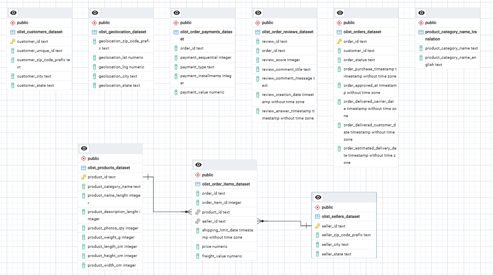

---

# 📊 Power BI Data Model

A star schema was implemented in Power BI to improve performance and simplify report development.

### Data Model Highlights

- Central **Fact Table:** `bi_fact_sales`
- **Date Dimension:** `DimDate`
- One-to-many relationship between the date dimension and fact table
- Optimized for time intelligence calculations (YTD, Rolling 30 Days, Monthly Trends)
- Supports DAX measures for KPI tracking and business analysis

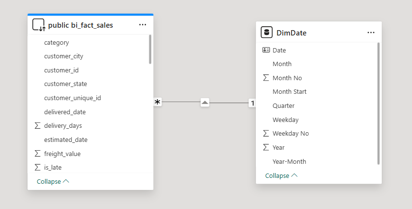

---

# 📈 Dashboard Preview

## 1. Executive Overview

The Executive Overview provides a high-level summary of business performance, including revenue, orders, customers, AOV, on-time delivery, and sales trends.

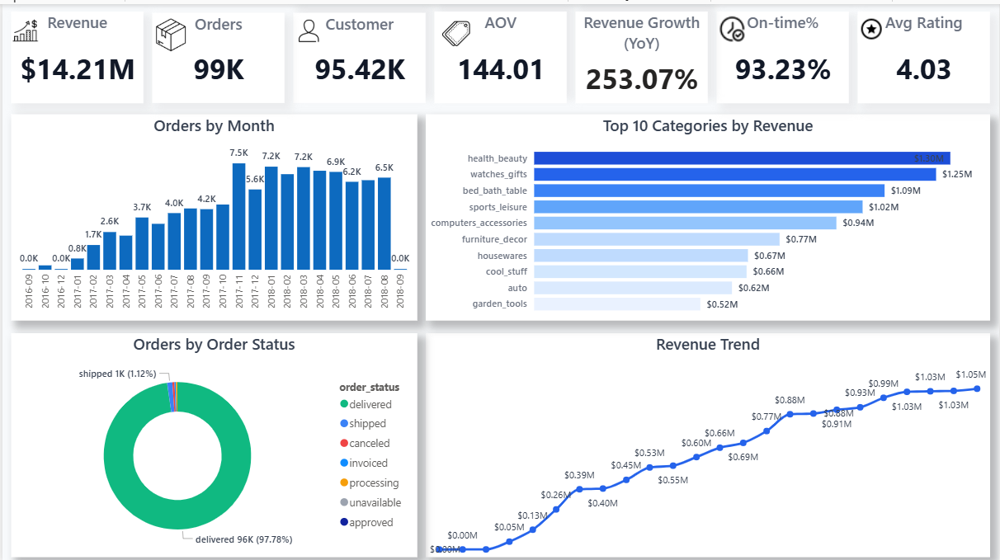

---

## 2. Sales Analytics

Analyze revenue growth, year-over-year performance, rolling 30-day revenue, YTD revenue, and category-wise sales performance.

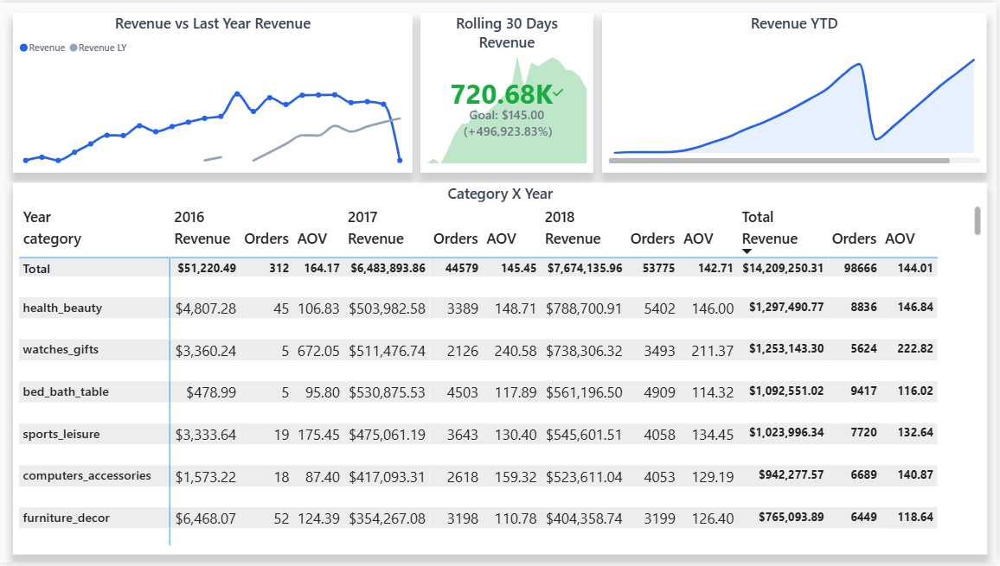

---

## 3. Product Analytics

Evaluate category performance through revenue, orders, AOV, ratings, and revenue contribution across product categories.

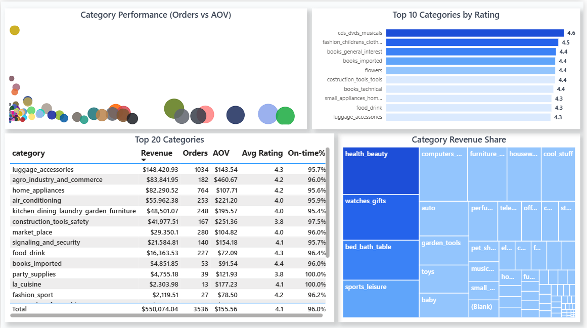

---

## 4. Customer Analytics

Explore customer distribution by state and city, along with regional revenue contribution.

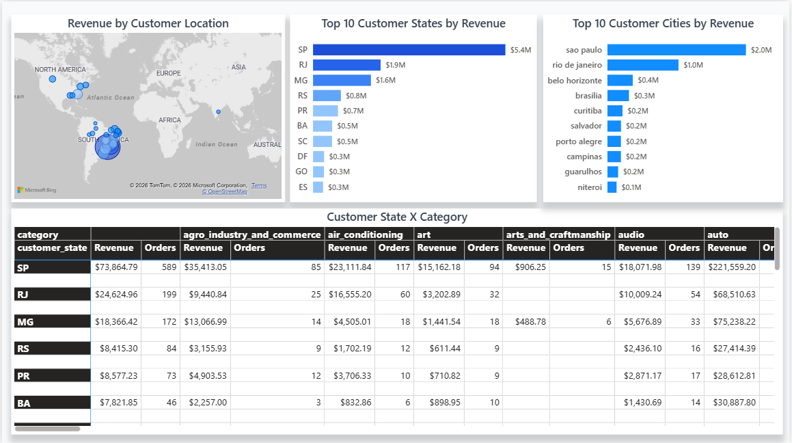

---

## 5. Delivery Analytics

Monitor delivery performance, identify late-delivery hotspots, and analyze average delivery time by category.

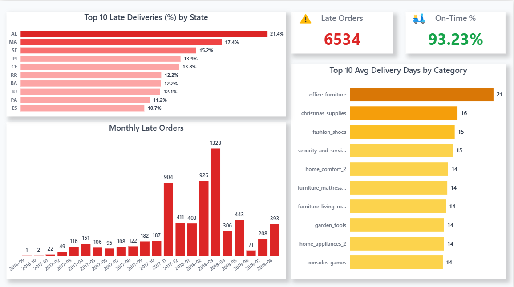

---

## 6. Customer Rating Analytics

Analyze customer satisfaction through rating distribution, review sentiment, and category-level ratings.

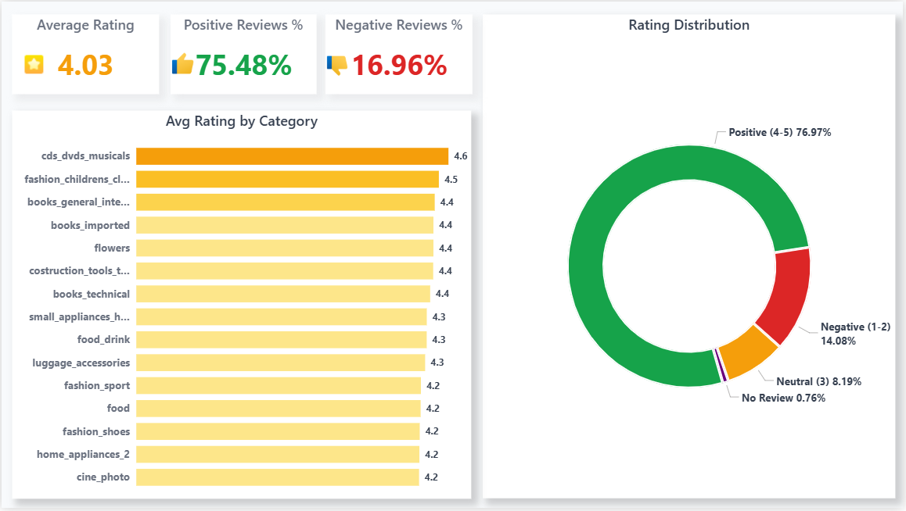

---

## 7. Payment Analytics

Understand payment preferences, installment behavior, payment value distribution, and payment trends.

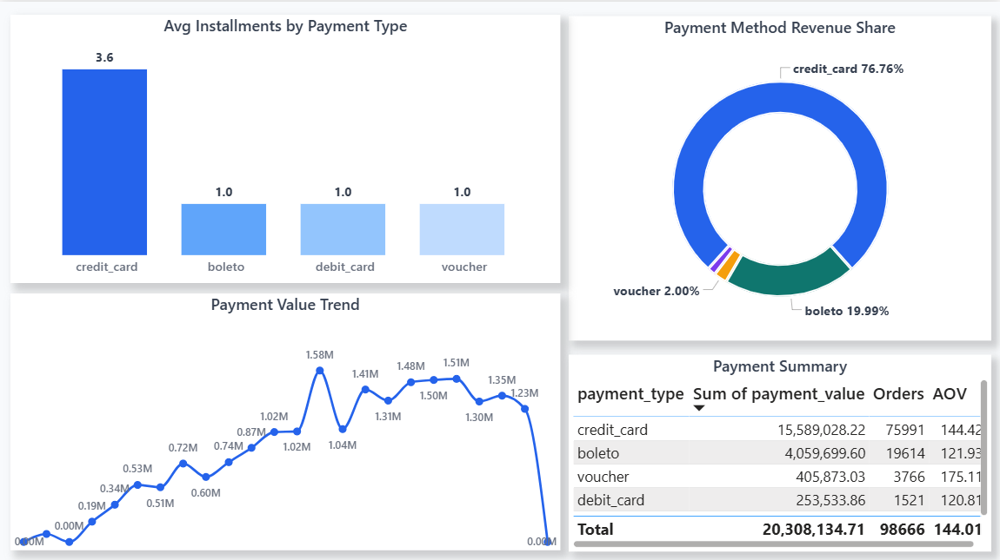

---

## 8. Seller Analytics

Track seller performance, revenue contribution, seller distribution, and top-performing sellers.

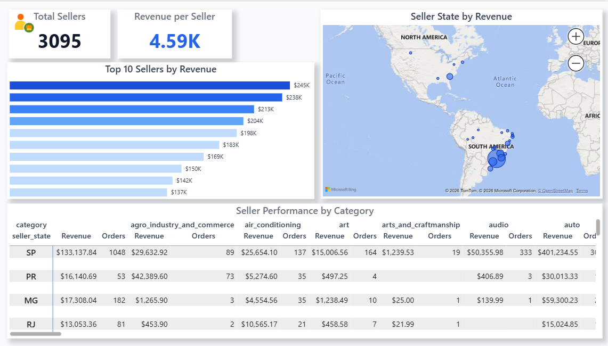

---
## 9. Category Drill-through

A detailed drill-through page providing in-depth analysis for an individual product category.

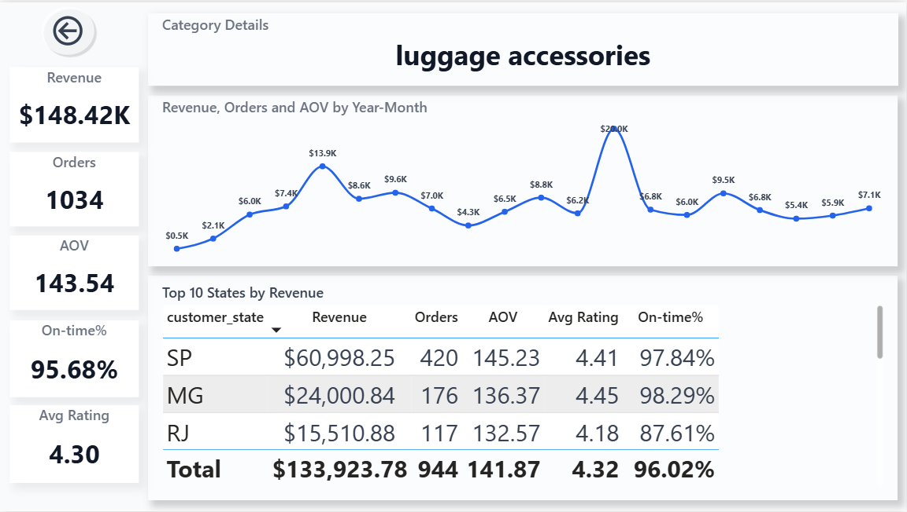

---

## 10. Business Insights & Recommendations

Summarizes key findings from the analysis and provides actionable business recommendations.

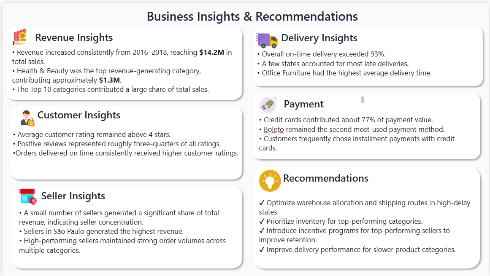

---

# 📈 Key Performance Indicators (KPIs)

The dashboard tracks important business metrics to evaluate overall e-commerce performance.

| KPI | Description |
|---|---|
| Total Revenue | Overall sales generated from completed orders |
| Total Orders | Number of customer orders processed |
| Total Customers | Number of unique customers |
| Average Order Value (AOV) | Average revenue generated per order |
| Average Rating | Customer satisfaction score based on reviews |
| On-Time Delivery % | Percentage of orders delivered within estimated time |
| Late Delivery % | Percentage of delayed deliveries |
| Revenue YTD | Year-to-date revenue performance |
| Rolling 30-Day Revenue | Short-term revenue trend monitoring |
| Revenue Growth | Comparison against previous periods |

---

# 💡 Business Insights

The analysis revealed several key findings:

### Sales Performance
- Revenue showed consistent growth between 2016 and 2018.
- A small number of product categories contributed a significant share of total revenue.

### Customer Behavior
- São Paulo generated the highest customer and revenue contribution.
- Credit cards were the most preferred payment method.

### Delivery Performance
- Most orders were delivered successfully within the estimated timeline.
- Categories with longer delivery times showed lower customer ratings.

### Seller Performance
- Revenue contribution was concentrated among top-performing sellers.
- Seller performance varied significantly across regions.

### Customer Satisfaction
- Higher-rated categories generally showed better delivery performance.
- Review scores provided insights into operational improvements.
  
---

# 💡 Key Business Insights

• Health & Beauty generated the highest revenue.

• Revenue increased consistently from 2016 to 2018.

• Credit Card accounted for nearly 77% of total payment value.

• On-time delivery exceeded 93%.

• Office Furniture showed the highest delivery time.

• São Paulo generated the highest revenue among states.

• Faster deliveries received better ratings.
  
---

## 📌 Recommendations

Improve logistics in high-delay states.

Maintain inventory for high-performing categories.

Optimize delivery time for Office Furniture.

Reward top-performing sellers.

Increase focus on high-rating categories.
  
---

## 🛠 Tools

PostgreSQL

Power BI

Power Query

DAX

GitHub
  
---

## 👤 Author

Mukta Raj

LinkedIn www.linkedin.com/in/muktaraj07

GitHub
